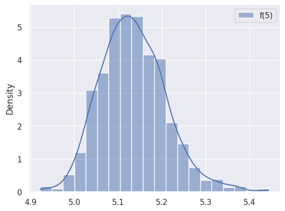

# NTK vs Backpropagation

In the large network width $N$ limit, the neural network become _Gaussian process_ with it's output probability density being:

$$
f(x) = \mathcal{N} e^{-Ky^2}
$$

for some constants $\mathcal{N}$ and $K$, the [neural tangent kernel](https://arxiv.org/abs/1806.07572) can be used to approximate the average value of a linear network's output for a dataset $(X,Y)$ as

$$
f(x) = x^\top (XX^\top)^{-1}XY 
$$

In this notebook, the above expression is compared with the output of a **trained** neural network for th MNIST dataset.

The average value of the predictor can be plotted for different MNIST examples

<table>
  <tr>
    <td align="center">
      
       
      <em>Probability density plot for the output $(x) of a trained neural network. In this case the digit "5" is passed in the input. The output of the network is a smooth bell-like curve around 5. According to the large N limit behaviour, this curve asymptotically moves the normal distribution at large N. </em>
    </td>
  </tr>
</table>