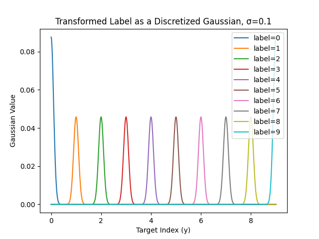
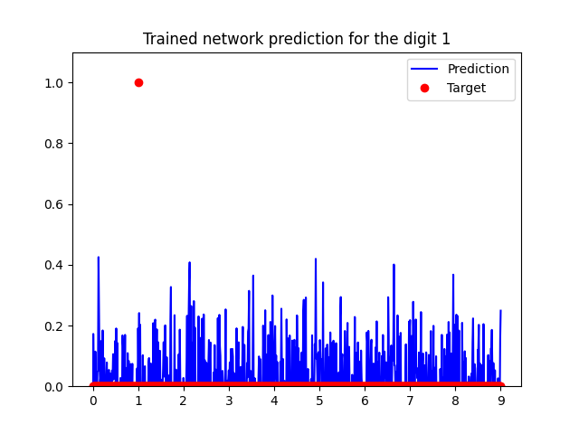

# Statistical mechanics of Neural networks (NN-STM)

This is a repository containing python files used to compare exact analytical solutions for the partition function of _Linear_ neural networks with the ones computed through ordinary backpropagation.

## About the project

The aim of the project is to establish connections and differences between analytical calculations of the partition function of neural networks and ones computed through backpropagation. The general idea is that the partition function encodes all the statistical information of the system via:

$$
Z(\beta) = \int \mathcal{DW} \;e^{-\beta \mathcal{L}}
$$

where, $\mathcal{W}$ are the internal weights of the system, $\mathcal{L}$ is the loss function. A **learning algorithm** (LA) can be thought in physics terms as cooling the system down, this leads to the _annealed_ partition function:

$$
Z_{LA} = \lim_{\beta\rightarrow\infty}Z(\beta)
$$


### Comparison between annealed and exact partition functions


Relating to the contents of the `/exact_vs_anneal` folder. According to [Zavatone-Veth & Pehlevan](https://arxiv.org/abs/2104.11734) the prior density distibution of a Linear Bayesian neural network is given by

$$
p_2(\mathbf{h_2}|x) = \frac{1}{{(4\pi\kappa_2^2})^{n_2/2}}\frac{2}{\Gamma(n_1/2)} \left(\frac{||\mathbf{h_2}||}{2\kappa_2}\right)^{(n_1-n_2)/2}K_{(n_1-n_2)/2}\left(\frac{||\mathbf{h_2}||}{2\kappa_2}\right)
$$

For a network of constant width, this simplifies to:

$$
p_2(\mathbf{h_2}|x) = \frac{1}{{(4\pi\kappa_2^2})^{n/2}}\frac{2}{\Gamma(n/2)} K_0\left(\frac{||\mathbf{h_2}||}{2\kappa_2}\right)
$$

where, $\mathbf{h_2}$ is a vector encoding the preactivation of the last layer, $\kappa_2 = 2\pi\sigma_2^2$ is a measure of the standar deviation of the weight intialization of thelast layer, $x$ is a single training set example $\Gamma$ is the [gamma function](https://en.wikipedia.org/wiki/Gamma_function), $K_0$ is the modified [Bessel](https://en.wikipedia.org/wiki/Bessel_function) function of the second kind of order zero.

The above expression is compared with a prior distribution obtained by a trained network via a Gaussian KDE. Two arrays are computed, one `exact` and one `annealed` and then compared via

```
similarity = sp.spatial.distance.jensenshannon(exact, annealed)
```


### Regression with the MNIST dataset

Relating to the contents of the `/exact_vs_anneal` folder. Many of the methods used in the literature make use of the quadratic loss function for analytical computations. This in turn means that they are best suitted for regression problems. Here we transform the classification problem into a regression one



After training the model is evaluated on classifications of `MNIST` examples through the output distribution:

<table>
  <tr>
    <td align="center">
      
      <br>
      <em>Training Performance</em>
    </td>
    <td align="center">
      
      <br>
      <em>Validation Performance</em>
    </td>
  </tr>
</table>


## About the code

The code is structured in two directories, one containing the exact solution/annealing comparison and one containing the MNIST regression. The structure is as follows:

```
.
├── exact_vs_anneal
│   ├── __init__.py
│   ├── compare.py
│   ├── main.py
│   ├── network.py
│   └── prior.py
├── figures
├── README.md
└── regressNIST
    ├── dataset.py
    ├── main.py
    ├── network.py
    └── trainer.py
```

## Installation

You can install the repository by cloning the repository:

```
git clone https://github.com/chrishalkias/NNSTM
```

## Additional information

This project was done as part of my MSc degree in Leiden Univrsity under the supervision of prof. Koenraad Schalm. An online version of the thesis draft can be found in the [student thesis repository](https://studenttheses.universiteitleiden.nl/handle/1887/4255089)
